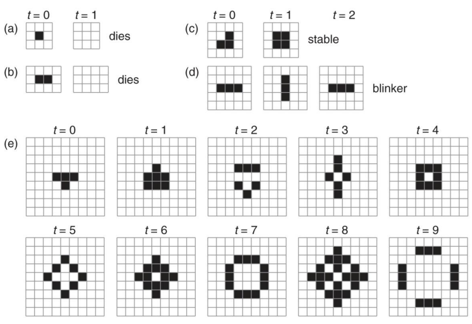
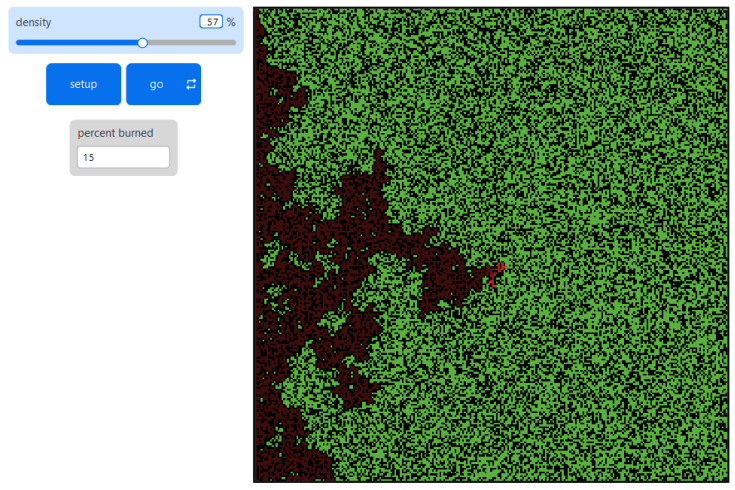
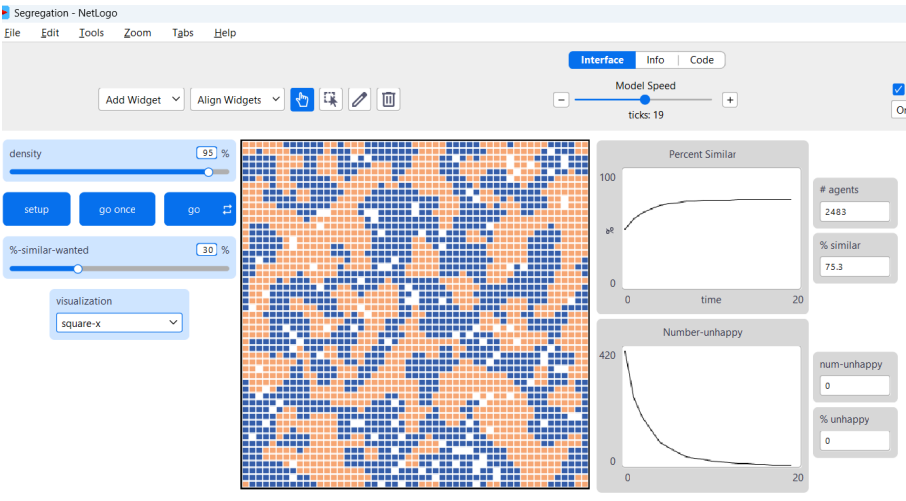
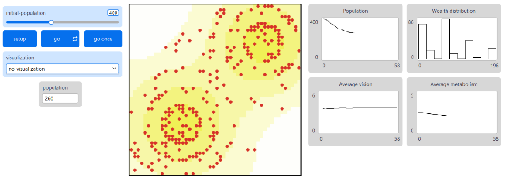

## Test 1

### 1. Vysvětlete rozdíl mezi systémem jednoduchým, chaotickým a komplexním. Uveďte příklady takových systémů.

**Jednoduchý systém**: **lineární** a **předvídatelný**, kde
výstup je přímo úměrný vstupu (příkl.: hodiny, mechanický stroj).

**Chaotický systém**: **deterministický**, ale **citlivý na malé změny**, což vede k nepředvídatelnosti (příkl.: počasí,
dvojité kyvadlo).

**Komplexní systém** **zahrnuje mnoho interagujících komponent**, kde vznikají **neočekávané vzorce** (emergence) bez
centrálního řízení (příkl.: ekosystém, společnost).

### 2. Uveďte konkrétní příklad komplexního systému, popište části a vazby, interakce či procesy.

Mraveniště

Části: mravenci (agenti), feromony (vazby).

Interakce: mravenci sledují feromony pro navigaci

Procesy: sběr potravy, obrana

### 3. Uveďte alespoň dvě definice komplexního systému.

1. Systém, v němž probíhá mnoho interakcí mezi mnoha komponentami (agenty).
2. Složený z kompenent a vazeb, chování komponenty závisí na chování ostatních komponent.
3. Vykazuje struktury s variacemi.
4. Návrhu, nebo fungování je těžké porozumět.
5. Evoluce je citlivá na výchozí podmínky.
6. V čase se vyvíjí.
7. Nelze popsat kompaktním způsobem.

### 4. Jmenujte alespoň čtyři vlastnosti komplexního systému.

* **Složité vazby**
* **Nelinearita** - dopad zásahů není vždy úměrný velikosti zásahu
* **Samoorganizace** - vznik chování, které není zakotveno v pravidlech
* **Emergence** - projevy na makroúrovni, které nemají ekvivalent na mikroúrovni
* **Dynamika** a **adaptabilita** - neustále dochází ke změnám a přizpůsobování okolnostem, ostatním entitám a
  zkušenostem
* **Heterogenita** - jednotlivé části celku mají svoje specifika; heterogenita je důsledkem adaptace částí systému

### 5. Vysvětlete pojem emergence z pohledu teorie komplexních systémů.

Projevy na makroúrovni, které nemají ekvivalent na mikroúrovni

### 6. Popište tzv. intuitivní lidské uvažování, jmenujte alespoň dvě typické chyby spojené s intuitivním uvažováním

Rychlé, heuristické myšlení založené na zkušenostech a zkratkách.

1. lineární uvažování
2. krátkodobé uvažování
3. záměna konsekvence za kauzalitu
4. záměna korelace za kauzalitu
5. záměna příčin a následků

### 7. Jmenujte alespoň pět principů systémového myšlení.

1. Usilovat o nadhled, pohled na celek místo detailů - (vidět les, ne stromy)
2. Postupovat od obecného ke specifickému
3. Sledovat dynamiku (procesy), ne stavy
4. Sledovat vztahy, souvislosti a interakce
5. Uvědomovat si zpětnou vazbu
6. Uvědomovat si relativnost a roli pozorovatele
7. Uvažovat dlouhodobě

### 8. Vysvětlete pojmy redukcionismus a holismus.

Celek je sumou svých částí, takže prozkoumání částí k pochopení celku postačuje

### 9. Vysvětlete rozdíl mezi induktivním a deduktivním uvažováním.

* **Dedukce** je **postup od obecného ke konkrétnímu** - „Ptáci mají peří. Slepice má peří. PROTO slepice je pták.“
* **Indukce** je **postup od konkrétního k obecnému** - „Slunce zatím vyšlo každé ráno. PROTO zítra vyjde slunce.“

### 10. Vysvětlete, jaké cíle si klade věda o komplexních systémech.

* Poskytnout interdisciplinární pohled na komplexní systémy, vyvinout potřebné matematické a výpočetní prostředky
* Navrhnout metodologii zkoumání komplexních systémů (kombinace teoretického výzkumu, experimentování a počítačových
  simulací)
* Navrhnout sjednocující, univerzální, obecnou teorii komplexních systémů

### 11. Popište model Ants z knihovny NetLoga.

Je to simulace kolonie mravenců hledajících potravu. Každý mravenec (agent) následuje jednoduchá pravidla: pohybuje se
náhodně, sbírá jídlo a uvolňuje feromony na cestě zpět do hnízda. Kolonie jako celek vykazuje sofistikované chování,
jako efektivní sběr potravy a tvorba stop, bez centrálního řízení.

### 12. Popište jednorozměrný buněčný automat a vysvětlete, co jsou Wolframovy třídy buněčných automatů.

Mřížka buněk v řadě, kde každá buňka má dva sousedy a nový stav závisí na stavu buňky a jejích sousedů podle pevných
pravidel.

Wolframovy třídy klasifikují chování:

1. homogenní stav
2. vyvinou se stálé jednoduché cyklické obrazce
3. vznikají struktury, které se nikdy neopakují - chaos
4. nepravidelně se objevují a mizí komplexní obrazce

### 13. Vysvětlete rozdíly mezi buněčným automatem homogenním a nehomogenním, synchronním a asynchronním, deterministickým a stochastickým.

* Homogenní CA má stejnou přechodovou funkci pro všechny buňky (včetně prostoru a času), nehomogenní se liší (např.
  okrajové buňky)
* Synchronní aktualizuje všechny buňky současně, asynchronní podle schématu (např. náhodně nebo pořadově)
* Deterministický má pevné pravidlo, stochastický zahrnuje pravděpodobnosti (např. šíření požáru)

### 14. Jmenujte alespoň tři aplikační oblasti (modely), v nichž našly uplatnění principy buněčných automatů.

* fyzikální modely - proudění kapalin, růst krystalů
* biologie - růst buněk, šíření požáru
* společenské vědy - doprava, osidlování území

### 15. Popište Conwayův model Life a jmenujte (nakreslete) typické struktury, které generuje.

* 2-dimenzionální buněčný automat
* Buňka má 8 sousedů a 2 možné stavy (živá, mrtvá)
* má to i svá pravidla

### 16. Vysvětlete pojmy perkolace, fázový přechod a dále vysvětlete souvislost těchto pojmů s buněčným automatem.

* **perkolace** - teorie studující vznik globální konektivit v náhodném systému
* **fázový přechod** - kritický jev, při kterém se systém kvalitativně změní po překročení určité prahové hodnoty
* **souvislost s buněčným automatem** - jev šíření - např. požár, kde při určité hustotě stromů dojde k globálnímu
  šíření – fázový přechod

### 17. Popište model Fire z knihovny NetLoga.

Simuluje šíření požáru v lese. Zelené patchy jsou stromy, červené hořící, hnědé spálené.

### 18. Vysvětlete principy agentového modelování.

* Globální chování systému **vzniká zespodu** – z interakcí mnoha jednoduchých agentů (tzv. **emergence**)
* zdola nahoru - autonomní agenti s atributy interagují s prostředím a mezi sebou podle jednoduchých pravidel

### 19. Popište model Segregace.

* simuluje vznik rasové segregace v populaci
* Inicializace: náhodné rozmístění agentů 2 typů a volných polí
* Agent má **k** sousedů a prahovou hodnotu **t**
* V každém kroku agent vypočte procento sousedů svého typu a pokud je zjištěná hodnota nižší, než prahová hodnota t,
  agent se přemístí na náhodně vybrané volné pole
* Dva procesy

1. **Tipping** - pohyb jednoho agenta vyvolá kaskádu přesunů dalších agentů
2. **Segregation** - počtet případů, kdy sousedící agenti jsou různého typu (nižší hodnota znamená výraznější oddělení)

### 20. Popište modely Sugarscape.

* agenti potřebují k přežití cukr, přesunují se mezi buňkami a hledají jej. Agenti mají různé vlastnosti
* **pravidla** - Definují chování agenta a průběh interakcí s prostředím i mezi agenty s prostředím. Lze specifikovat
  pohyb, metabolismus, znečišťování prostředí, obchodování, tvorbu imunity, ...
* Zkoumá se celková dynamika populace a její vliv na prostředí
* Přibližně po 20 krocích vzniká stabilní stav, kdy se agenti nepřemisťují vůbec, nebo jen minimálně, protože každý
  nalezl trvalý zdroj. Typické je rozmístění agentů po vrstevnicích

## Příkazy

* **turtles** - agenti
* **xcor** - X souřadnice agenta
* **ycor** - Y souřadnice agenta
* **heading** - směr (0 sever, 90 východ)
* **color** - barva agenta
* **shape** - vizuální tvar agenta
* **size** - velikost agenta

* **patch** - reporter, který vrací políčko mříšky podle souřadnic. Např: `patch 2 4 [ set color green ]`
* **pxcor** - obsahuje x-souřadnici patchu. Např: `ask patches [ if pxcor > 0 [ set pcolor blue ] ]`
* **pycor** - obsahuje y-souřadnici patchu. Např: `ask patches [ if pycor > 0 [ set pcolor blue ] ]`
* **pcolor** - drží barvu patchu (číslo 0–139 nebo RGB seznam [r g b]). Např: `ask patches [ set pcolor red ]`

* **ask** - primitiv, který umožňuje udělit příkazy jednomu agentovi. Např:
  `ask patches [ if pycor > 0 [ set pcolor blue ] ]`
* **set** - nastavuje hodnotu proměnné. Např: `set pcolor blue`
* **let** - vytváří dočasnou lokální proměnnou. Např: `let speed 5 ask turtles [ fd speed ]`
* **neighbors** - vrací agentset obsahující osm okolících patchů. Např:
  `ask patches [ ask neighbors [ set pcolor red ] ]`
* **neighbors8** - vrací agentset osm okolících patchů. Např: `ask patches [ ask neighbors8 [ set pcolor green ] ]`

* **one-of** - vrací náhodného agenta z daného agentset, náhodný prvek ze seznamu nebo náhodný znak z řetězce. Např:
  `ask turtles [ set color one-of base-colors ]`
* **n-of** - vrací agentset o velikosti n náhodně vybraných agentů z daného agentset, nebo seznam o velikosti n náhodných
  prvků ze seznamu. Např: `ask n-of 50 patches [ set pcolor green ]`
* **random** - vrací náhodné celé číslo od 0 (včetně) do n (nevčetně). Např: `show random 10` – vypíše náhodné číslo od 0 do
  9

* **count** - vrací počet agentů v daném agentset. Např: `show count turtles`
* **plot** - vykreslí bod na aktuálním grafu (plot) pomocí pera na aktuální x-souřadnici (obvykle tick) a zadané y-hodnotě.
  Např: `set-current-plot "Population" plot count turtles` - vykreslí počet želv na grafu "Population" v aktuálním ticku
* **show** - vypíše zadanou hodnotu do výstupní oblasti modelu. Např: `show abs -7` - vypíše 7

* **globals** - na začátku kódu modelu k definování globálních proměnných. Např: `globals [population speed]`
* **to** - k definici procedury, která provádí příkazy bez návratové hodnoty. Musí končit `end`. Např:
  `to setup clear-all crt 100 end`
* **end** - uzavírá definici procedury začáté `to` nebo `to-report`
