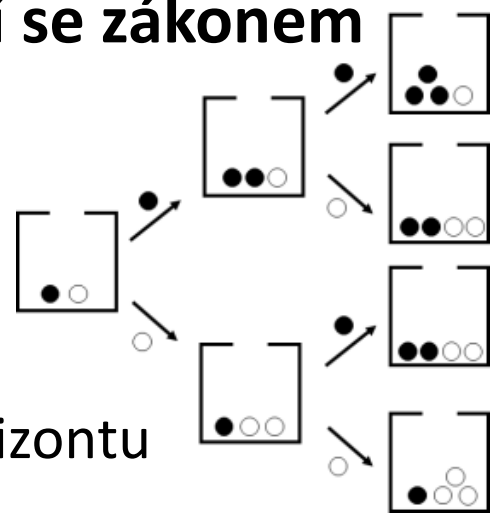

## Test 3

### 1. Vysvětlete pojem omezená racionalita; uveďte příklad situace, kdy se člověk záměrně rozhodne nehledat optimální řešení problému.

- lidé se při rozhodování nesnaží dosáhnout absolutně nejlepšího (optimálního) řešení, ale spokojí se s řešením, které
  je dostatečně dobré

### Důvody omezené racionality:

1. nedostupnost informací
2. nedostatek času na rozhodování
3. nedostatky v kognitivních schopnostech

### Příklad: hledání bytu

#### Optimální řešení

- procházení všech inzerátů
- navštívení co nejvíce bytů
- sestavení tabulky s kritérii

#### Reálné řešení

- prohlédnutí třeba 10 bytů a následné vybrání prvního vhodného

### 2. Vysvětlete na vhodném příkladu rozdíl mezi klasickým ekonomickým modelem a výpočetním (simulačním modelem) téže situace.

- Klasický ekonomický model předpokládá dokonale racionální a homogenní investory, takže trh okamžitě konverguje k
  fundamentální ceně akcie a zůstává v rovnováze bez bublin a krachů.
  Výpočetní simulační model (např. Santa Fe Artificial Stock Market) s heterogenními, omezeně racionálními agenty, kteří
  se učí pomocí if-then pravidel, dokáže ze stejných fundamentů endogenně vytvořit reálně vypadající bubliny, krachy a
  vysokou volatilitu.

#### Rozdíly

- Agenti: Klasický – homogenní, dokonale racionální • Simulační – heterogenní, omezeně racionální
- Rozhodování: Klasický – deduktivní (spočítají správnou cenu) • Simulační – induktivní (if-then pravidla + učení)
- Informace: Klasický – dokonalé informace a common knowledge racionality • Simulační – neúplné informace, každý vidí
  trh po svém
- Výsledek trhu: Klasický – okamžitá a trvalá konvergence k fundamentální ceně • Simulační – může být rovnováha nebo
  bubliny, krachy, vysoká volatilita
- Bubliny a krachy: Klasický – nevysvětlitelné (jen „iracionalita“) • Simulační – vznikají přirozeně (endogenně) i bez
  vnějších šoků
- Dynamika: Klasický – trh je vždy v rovnováze • Simulační – trh je dynamický, nikdy plně v rovnováze, neustále se
  vyvíjí
- Realističnost: Klasický – velmi nízká • Simulační – vysoká, reprodukuje stylizovaná fakta reálných trhů

### 3. Vysvětlete model Polyovy urny.

- model systému, který se řídí se zákonem rostoucích výnosů
- Urna s černými a bílými kameny, které postupně losujeme
- Kámen, který vylosujeme, vložíme zpět a přidáme další kámen téže barvy
- Zajímá nás podíl černých kamenů v delším horizontu

- Pravidla jsou jednoduchá, výsledky překvapivé – Jakýkoli poměr má šanci „být zvolen“

### 4. Vysvětlete pojmy umělá společnost, syntetická populace, výpočetní ekonomika.

#### Umělá společnost

- Model, ve kterém mnoho jednoduchých agentů vzájemně interaguje podle předem daných pravidel a z těchto interakcí
  vznikají složité jevy na úrovni celé „společnosti“ - emergence
- příklad: model Sugarscape

#### Syntetická populace

- Uměle vytvořený soubor „jedinců“, který statisticky odpovídá skutečné populaci (např. podle věku, pohlaví).
- Slouží k simulaci a analýze chování celé společnosti (např. šíření epidemie, dopravy, evakuace)

#### Výpočetní ekonomika

- přístup v ekonomii, který používá počítačové modely a simulace k analýze chování ekonomických systémů, místo aby
  spoléhal jen na čistě analytické (papír–tužka) modely.
- Zaměřuje se na situace, kde je ekonomika chápána jako komplexní systém mnoha interagujících aktérů, a pomocí výpočtů
  zkoumá vznik makrojevů, jako jsou tržní cykly, krize nebo dopady regulací.

### 5. Jmenujte alespoň tři otázky, na které lze hledat odpovědi prostřednictvím modelů epidemií.

#### Šíření infekce

- Jak rychle a na jak velkou část populace se dané infekční onemocnění rozšíří při různých hodnotách reprodukčního
  čísla.

#### Dopad na opatření

- Jaký dopad budou mít různá opatření (očkování, karanténa, uzavření škol, roušky) na průběh epidemie a počet nakažených
  či hospitalizovaných.

#### Sledování vývoje

- Kdy přibližně nastane vrchol epidemie a kolik lůžek či kapacit intenzivní péče bude v různých scenářích potřeba.

### 6. Popište hlavní metody matematické a výpočetní epidemiologie.

#### Statistické metody

- tradiční přístup, zpracování historických dat

#### Dynamické modely

- modely hostitele a patogenu, modely šíření nemoci; diferenciální rovnice

#### Pravděpodobnostní modely

- stochastické procesy, perkolace, Markovské řetězce

#### Diskrétní matematika, teoretická informatika, síťové modely

- studuje se šíření skrze sociální sítě

### 7. Vyjmenujte a stručně popište základní deterministické modely šíření epidemií.

#### SIS

- Nejjednodušší: jedinec onemocní, uzdraví se a může opět onemocnět

#### SIR

- Jedinec onemocní maximálně jednou, po nemoci už k ní není náchylný

#### SIRS

- Jedinec je po vyléčení po nějakou dobu imunní, potom opět náchylný onemocnět

### 8. Vysvětlete rozdíly mezi matematickým, agentovým a síťovým SIR modelem.

#### Matematiký SIR

- Velká populace, jeden výchozí stav, bez inkubační doby
- Homogenní prostředí = míra kontaktu zdravých a nemocných závisí jen na velikostech populací S

#### Agentový SIR

- Populace může být heterogenní
- Agenti se náhodně pohybují v prostoru (zdravý agent se může nakazit od infekčního souseda)
- Infekční agent může zemřít (s určitou pravděpodobností)

#### Síťový SIR

- Síť (náhodná, bezškálová) reprezentuje kontakty
- Epidemie se šíří po hranách (zdravý uzel se od infekčního souseda nakazí s danou pravděpodobností)
- Infekční uzel s určitou pravděpodobností zemře (je pak odstraněn ze sítě spolu se všemi svými hranami)

### 9. Popište model SIR, vysvětlete pojem základní reprodukční číslo.

- 3 skupiny: vnímaví (S – susceptible), aktuálně nakažení a infekční (I – infectious), uzdravení nebo odstranění z
  procesu šíření (R – removed)
- Jedinec onemocní maximálně jednou, po nemoci už k ní není náchylný (z různých důvodů)
- Např. pandemie chřipky, SARS, Ebola
- Základní reprodukční číslo R0 je průměrný počet dalších osob, které jeden typický infekční jedinec nakazí v úplně
  vnímavé populaci, tedy na začátku epidemie, kdy dosud nikdo nemá imunitu

### 10. Popište alespoň tři možnosti, jak lze epidemiologické modely rozšiřovat (zdokonalovat, udělat realističtější).

#### Podrobnější populační model

- Věk – min./max. věk, kdy je možné onemocnět; popř. náchylnost se může s věkem měnit
- Imunita, popř. schopnost nákazu šířit (týká se informací, technologií)

#### Modelování kontaktů

- Homogenní populace, míra kontaktu závisí na počtech nemocných a zdravých
- Subpopulace s homogenními kontakty uvnitř a s méně kontakty navenek (např. sociální skupiny, fyzické oddělení)
- Konkrétní model společenského života na základě geografických a demografických dat

#### Populační dynamika a čas

- Porodnost a úmrtnost – je zásadní u nemocí, kde jedinci získávají vyléčením trvalou imunitu
- Časové hledisko se týká i ročních období

#### Zásahy proti epidemii

- Nemoci – snaha je omezit
- Technologie – snaha je rychleji šířit (reklama)
- Snížení infekčnosti:
-
    - Fyzické bariéry – snížení množství kontaktů
-
    - Vakcinace

#### Mutace nemoci

- Např. chřipka – objevují se nové varianty
- Koevoluce mezi populací a virem – udržuje se diverzita populace

### 11. Vysvětlete vztah mezi adaptivitou a emergencí v komplexním systému.

#### Adaptivita

Schopnost systému měnit své chování podle zkušenosti nebo podle změn v prostředí (učení, evoluce, změna strategií)

#### Emargence

Jev, kdy z těchto lokálních změn a interakcí jednotlivých částí vznikají nové, „globální“ vzorce chování systému,
které nejsou přímo naprogramované ani triválně odvoditelné z vlastností jednotlivých částí.

### 12. Uvedťe, jaké výpočetní přístupy lze použít k implementaci adaptivních agentů nebo adaptivních populací.

- reinforcement learning - agent si zkouší akce v prostředí a podle odměn/trestů upravuje svou politiku chování
- evoluční a genetické algoritmy - pracují s populací jedinců, které se selekcí, mutacemi a rekombinací postupně
  zlepšují podle zvolené fitness funkce
- neuronové sítě - slouží jako adaptivní funkce/mapování, které se průběžně učí na datech nebo v kombinaci s
  reinforcement learning
- Bayesovské učení + jednoduché heuristiky – modely chování při epidemiích

### 13. Uveďte příklad komplexního systému s adaptivními agenty.

#### Finanční trh

Jednotliví obchodníci/investoři (lidé i algoritmy) průběžně mění své strategie podle cen, zpráv a chování ostatních.
Výsledkem jejich lokální adaptace jsou emergentní jevy na úrovni celého trhu.

### 14. Vysvětlete pojem stigmergie.

Způsob nepřímé komunikace a koordinace mezi agenty, kdy si navzájem „předávají informace“ přes změny ve společném
prostředí, ne přímo. Typický příklad jsou mravenci, kteří ukládají feromonové stopy: každý jedinec jen reaguje na stopy
v prostředí, ale dohromady tak vznikají organizované trasy a složité struktury.

### 15. Popište mravenčí algoritmus hledání nejkratší cesty.

- simuluje kolonií mravenců, kteří v grafu mezi startem a cílem náhodně hledají cesty a na navštívených hranách
  zanechávají „feromon“ – čím kratší cesta, tím silnější stopa. V dalších iteracích se mravenci rozhodují
  pravděpodobnostně podle kombinace délky hrany a množství feromonu

- Počet jedinců je konečný, komunikace je nepřímá
- Na základě posloupností tahů (řešení lokálních situací) se hledá nejkratší cesta z místa A do místa B
- Výhodnější cesta je rozeznatelná podle intenzivnější feromonové stopy => funguje jako pozitivní zpětná vazba
- Při rozhodování mravenec pracuje s lokální informací
-
    - Veřejná informace = intenzita feromonové stopy
-
    - Soukromá informace = interní stav

### 16. Vysvětlete princip ACO algoritmů.

- spočívá v iterativní simulaci kolonie umělých mravenců, kteří v grafu náhodně prohledávají cesty mezi uzly (např.
  městy v obchodním cestujícím) a na hranách zanechávají „feromonové stopy“ úměrné kvalitě nalezeného řešení – kratší
  cesta znamená silnější stopu

- Mravenci ukládají feromon na cesty, které vedou k jídlu; kratší/lepší cesty jsou rychleji projity → feromon se na nich
  kumuluje → více mravenců je volí → pozitivní zpětná vazba
- Umělí mravenci: Každý mravenec postupně konstruuje jedno možné řešení (např. jednu trasu v obchodního cestujícího)
- Nepřímá komunikace (stigmergie): Mravenci nemluví spolu přímo, ale mění prostředí
- Pravděpodobnostní volba dalšího kroku: Čím více feromonu a čím kratší/lepší hrana, tím vyšší pravděpodobnost, že
  mravenec hranu zvolí

### 17. Vysvětlete zadání problému obchodního cestujícího a jeho řešení použitím ACO algoritmu.

- N měst, propojených cestami – graf (N,E)
- Hledá se nejkratší okružní cesta, která každým městem projde právě jednou
- Mravenec je agent s těmito vlastnostmi:
-
    - Volí si další město na základě pravděpodobnosti, která je funkcí vzdálenosti města
      a množství feromonu na cestě k městu
-
    - Již navštívené město si znovu vybrat nemůže (tabu-list – nakonec se použije k
      výpočtu délky cesty daného mravence)
-
    - Po dokončení okružní trasy agent na každou hranu cesty umístí feromon

### 18. Vysvětlete pojem koordinace a uveďte, jak lze koordinaci implementovat v agentovém modelu.

Proces, který zajišťuje, aby činnosti jednotlivých agentů byly vzájemně sladěné tak, že se efektivně využívají zdroje a
systém jako celek směřuje k žádoucím cílům místo chaotického chování. Jde tedy o to, jak se mnoho autonomních agentů
domluví „kdo co kdy dělá“, aby minimalizovali konflikty (kolize, zácpy, duplicity) a maximalizovali společný výkon

TODO: idk jestli to má být tohle

#### Implicitní koordinace a lokální pravidla interakce

Vzejde z jednoduchých pravidel agentů a lokálního vnímání (např. Ants, Flocking, modely pohybu chodců)

#### Explicitní koordinace

Agenti plní role nebo dodržují přidělené strategie (např. Traffic Grid, týmy hasičů, týmy hokejistů,… )

### 19. Popište koordinaci založenou na lokálních pravidlech, uveďte příklad aplikace.

Každý agent se rozhoduje jen podle informací z bezprostředního okolí (stav sousedů, lokální prostředí) a jednoduchých,
předem daných pravidel, bez centrálního řízení nebo globálního přehledu. Z těchto lokálních interakcí pak vzniká
uspořádané chování celého systému (emergence), například plynulý tok, rozdělení práce nebo formování struktur.

Příkladem aplikace je řízení rojů robotů nebo dronů, kde každý robot dodržuje pravidla typu „drž se v určité vzdálenosti
od sousedů“, „vyhýbej se překážkám“ a „pohybuj se zhruba směrem k cíli“, a roj jako celek tak dokáže prohledávat oblast,
sledovat cíl nebo vytvářet formace bez centrálního plánovače.

### 20. Popište koordinaci založenou na stigmergii, uveďte příklad aplikace.

Nepřímá koordinace agentů prostřednictvím změn ve sdíleném prostředí: každý agent zanechá v prostředí nějakou „stopu“ (
značku, feromon, záznam v tabulce, změnu mapy) a ostatní agenti na tyto stopy reagují svým chováním. Agenti si tedy
přímo neposílají zprávy ani nemají centrálního koordinátora; společné chování systému vzniká z lokálních reakcí na tyto
stopy (samoorganizace).

Příkladem aplikace je mravenčí optimalizace cest: virtuální „mravenci“ při průchodu grafem posilují na hranách
feromonovou stopu úměrnou kvalitě (krátkosti) nalezené cesty a další mravenci pak preferují hrany se silnější stopou,
čímž se kolonie postupně zkoordinuje na dobrém nebo optimálním řešení.

### Models Library NetLogo

#### Ants

Účelem modelu je ilustrovat fungování stigmergie. Agenti reprezentují mravence, kteří hledají zdroje potravy. Vstupem je
velikost populace a parametry chemické stopy, výstupem je graf zachycující proces transportu potravy do mraveniště.
Exprimentálně lze zkoumat např. vztah mezi velikostí populace a časem potřebným na transport, nebo vztah mezi
proměnnými, které definujíí vlastnosti chemické stopy.

## 1. Ants

### Popis modelu
- model ukazuje stigmergii: mravenci kladou feromonové stopy a hledají potravu

### Vstupy
1. velikost populace  
2. parametry feromonu (intenzita, vypařování)

### Výstupy
- množství dopravené potravy, průběhový graf, mapa stop

### Příklad experimentu
- vliv velikosti populace na rychlost přenosu potravy  
- vztah mezi vypařováním feromonu a efektivitou hledání

---

## 2. BeeSmart Hive Finding

### Popis modelu
- včely kolektivně vybírají nové místo pro úl pomocí tance a hlasování

### Vstupy
1. počet průzkumnic  
2. kvalita úlů  
3. prahová hodnota konsensu

### Výstupy
- vybraný úl, čas do rozhodnutí

### Příklad experimentu
- jak změna počtu průzkumnic ovlivní rychlost rozhodnutí  
- jak šum v odhadu kvality vede k chybnému výběru

---

## 3. Flocking

### Popis modelu
- model hejn založený na pravidlech: vyhýbání, zarovnání, přibližování

### Vstupy
1. váhy tří pravidel  
2. viditelnost  
3. počet agentů

### Výstupy
- stabilita hejna, vzory pohybu

### Příklad experimentu
- vliv váhy alignment na soudržnost hejna  
- kdy se hejno rozpadá při malé viditelnosti

---

## 4. Termites

### Popis modelu
- jednoduché chování termitů vede ke shlukování dřevěných třísek

### Vstupy
1. počet termitů  
2. počet třísek  
3. pravděpodobnost zvednutí/položení

### Výstupy
- míra shlukování, počet hromádek

### Příklad experimentu
- vliv počtu termitů na rychlost clusteringu  
- vliv změny pravidel zvednutí/položení

---

## 5. Wolf Sheep Predation

### Popis modelu
- dynamika predátor–kořist s trávou jako zdrojem obnovy

### Vstupy
1. počty vlků a ovcí  
2. reprodukční míry  
3. rychlost obnovy trávy

### Výstupy
- časové řady populací

### Příklad experimentu
- podmínky stabilního soužití populací  
- vliv obnovy trávy na cykly

---

## 6. Game of Life

### Popis modelu
- cellulární automat s jednoduchými pravidly a komplexní emergencí

### Vstupy
1. počáteční konfigurace  
2. velikost mřížky

### Výstupy
- vzory (oscilátory, glidery), počet živých buněk

### Příklad experimentu
- jak malé změny počáteční konfigurace ovlivní výsledek  
- které vzory jsou stabilní

---

## 7. Segregation

### Popis modelu
- Schellingův model rezidenční segregace

### Vstupy
1. tolerance (práh spokojenosti)  
2. hustota osídlení  
3. rozložení dvou skupin

### Výstupy
- mapa segregace, index segregace

### Příklad experimentu
- vliv tolerance na míru segregace  
- vliv počátečního promísení

---

## 8. Virus

### Popis modelu
- šíření viru v prostoru na základě kontaktů agentů

### Vstupy
1. infekčnost  
2. délka infekce  
3. počáteční počet nakažených

### Výstupy
- průběh počtu nakažených, vyléčených, imunních

### Příklad experimentu
- jak změna infekčnosti ovlivní epidemii  
- vliv mobility agentů na šíření

---

## 9. Virus on Network

### Popis modelu
- šíření viru po sociální síti (grafu)

### Vstupy
1. typ sítě  
2. infekčnost  
3. počáteční nakažení uzly

### Výstupy
- rychlost šíření, velikost epidemie

### Příklad experimentu
- odstranění uzlů s vysokým stupněm a jeho vliv  
- epidemický práh v různých sítích

---

## 10. Vants (Langton’s Ant)

### Popis modelu
- jednoduchý automat s chaosem a emergentní „dálnicí“

### Vstupy
1. počet vantů  
2. počáteční orientace  
3. barvy buněk

### Výstupy
- vznikající vzory, směr dálnice

### Příklad experimentu
- interakce více vantů  
- vliv změny pravidel otočení

---

## 11. El Farol

### Popis modelu
- koordinační problém: agenti se rozhodují, zda jít do baru s omezenou kapacitou

### Vstupy
1. kapacita baru  
2. predikční strategie  
3. paměť agentů

### Výstupy
- počty návštěvníků, stabilita kolem průměru

### Příklad experimentu
- vliv různých strategií na stabilitu návštěvnosti  
- co se stane při zvýšení kapacity

---

## 12. Prisoner's Dilemma – Two Person Iterated

### Popis modelu
- opakovaná hra dvou hráčů, analýza kooperace a defekce

### Vstupy
1. strategie hráčů  
2. počet kol  
3. výplatní matice

### Výstupy
- celkové výplaty, míra kooperace v čase

### Příklad experimentu
- porovnání Tit-for-Tat a Always Defect  
- kdy se vyplatí odpouštět

---

## 13. Prisoner's Dilemma – N-Person Iterated

### Popis modelu
- dilema veřejných statků v rámci více hráčů

### Vstupy
1. počet hráčů  
2. strategie  
3. počet opakování

### Výstupy
- průměrná kooperace, udržení/kolaps veřejného statku

### Příklad experimentu
- vliv velikosti skupiny na kooperaci  
- účinnost trestajících strategií

---

## 14. Prisoner's Dilemma – Basic Evolutionary

### Popis modelu
- evoluční dynamika strategií, úspěšné strategie se rozmnožují

### Vstupy
1. počáteční podíly strategií  
2. výplatní matice  
3. selekční pravidla

### Výstupy
- vývoj podílů strategií, stabilní evoluční strategie

### Příklad experimentu
- kdy přežije Tit-for-Tat  
- kdy defekce převládne
